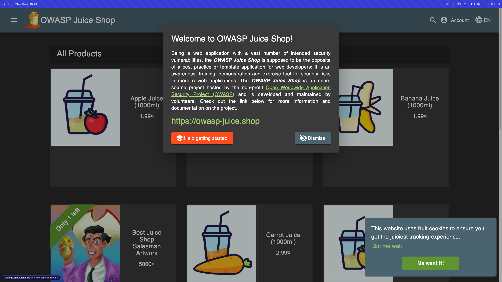
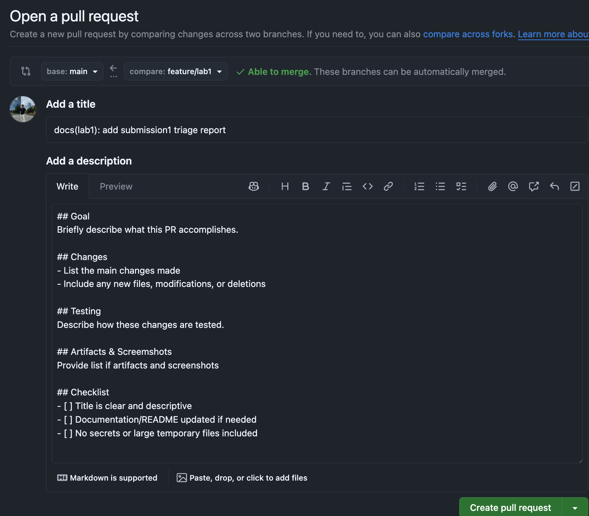

# Triage Report — OWASP Juice Shop

## Scope & Asset
- Asset: OWASP Juice Shop (local lab instance)
- Image: `bkimminich/juice-shop:v19.0.0`
- Release link/date: https://github.com/juice-shop/juice-shop/releases/tag/v19.0.0 — Released approximately 4 months ago (October 2025)
- Image digest (optional): sha256:2a95df217ff812f173a6ee032816172e401f641d2a9cf526011d62b9734b503c

## Environment
- Host OS: macOS 26.2
- Docker Version: 28.0.4 (Docker Desktop 4.40.0)

## Deployment Details

- Run command used:  

  ```bash
  docker run -d --name juice-shop -p 127.0.0.1:3000:3000 bkimminich/juice-shop:v19.0.0
  ```

- Accessed URL: `http://127.0.0.1:3000`
- Network exposure: 127.0.0.1 only [x] Yes  [ ] No  
  - Explanation: The `-p 127.0.0.1:3000:3000` flag binds the container port only to localhost (127.0.0.1), preventing external network access. This is a security best practice for lab environments.

## Health Check Evidence

- Page load (screenshot of home page):

  Example embed format:

  


- API check — first 10 lines from:

  ```bash
  curl -s http://127.0.0.1:3000/rest/products | head
  ```

  Output:

  ```html
  <html>
  <head>
    <meta charset='utf-8'> 
    <title>Error: Unexpected path: /rest/products</title>
    <style>* {
  margin: 0;
  padding: 0;
  outline: 0;
}
  ```

## Surface Snapshot (Triage)

- Login/Registration visible: [x] Yes  [ ] No  
  - Notes: Login and registration links are visible in the top navigation menu of the Juice Shop application.

- Product listing/search present: [x] Yes  [ ] No  
  - Notes: The home page displays a product grid with multiple items, and a search bar is available in the navigation menu.

- Admin or account area discoverable: [x] Yes  [ ] No  
  - Notes: Account/profile areas are available after login.

- Client-side errors in browser console: [ ] Yes  [x] No  
  - Notes: No client-side errors observed in the browser console during initial triage.
  
- Security headers (from `curl -I`):  
  - CSP present: [ ] Yes  [x] No
  - HSTS present: [ ] Yes  [x] No 

## Top 3 Risks Observed

1. **Intentionally Vulnerable Application Exposed Locally** — Juice Shop is designed to contain multiple security vulnerabilities for educational purposes. While bound to localhost only, it should never be deployed to production or exposed to external networks, as it contains known exploitable vulnerabilities including SQL injection, XSS, and authentication bypasses.

2. **Missing or Weak Security Headers** — Based on initial triage, security headers such as Content-Security-Policy (CSP) and Strict-Transport-Security (HSTS) may be missing or improperly configured. This increases the risk of cross-site scripting (XSS) attacks and man-in-the-middle (MITM) attacks if the application were ever exposed to the internet.

3. **Discoverable Admin and Authentication Endpoints** — The application exposes administration interfaces and authentication endpoints that are easily discoverable. This increases the attack surface for brute-force attacks, privilege escalation attempts, and unauthorized access attempts. While intentional for training purposes, this represents a significant risk in a production environment.

---

## Task 2 — PR Template Setup & Verification

### 2.1 PR Template Creation

- Template file path: `.github/pull_request_template.md`
- Sections: Goal, Changes, Testing, Artifacts & Screenshots
- Branch where template was added: `main`
- Commit message used:

  ```bash
  git commit -m "docs: add PR template"
  ```

### 2.2 Process
- Created and pushed template file on `main` so GitHub auto-loads it for PRs.
- Opened PR from `feature/lab1` → firstly to my fork `main`
- Verification screenshot: 


### 2.3 Reflection — How Templates Improve Workflow

Templates improve collaboration workflow in several key ways:

- **Consistency**: Every PR follows the same structure, making it easier for reviewers to quickly understand the purpose, changes, and testing approach without having to dig through code or ask questions.

- **Quality Assurance**: The checklist ensures critical items aren't forgotten (like updating documentation or checking for secrets), reducing the risk of security issues or incomplete submissions.

- **Time Savings**: Reviewers can quickly scan standardized sections to understand what changed and how it was tested, reducing back-and-forth communication and speeding up the review process.

- **Documentation**: Templates encourage contributors to document their work, creating a better historical record of changes and decisions.

---

## Challenges & Solutions

- **Challenge**: get familiar with possible security flags and what do they mean
  **Solution**: studied in google, and then answered questions about them

---

## GitHub Community

### Actions Performed

- [x] Starred the course repository
- [x] Starred `simple-container-com/api`
- [x] Followed `@Cre-eD`
- [x] Followed `@marat-biriushev`
- [x] Followed `@pierrepicaud`
- [x] Followed 3 classmates (usernames: idio4, Aleliya, FaritSharafutdinov)

### Why This Matters

**Why starring repositories matters:**

Starring repositories acts as a bookmarking mechanism, allowing developers to save interesting projects for future reference. Stars also serve as a signal of project quality and community trust—projects with higher star counts are more likely to attract contributors and gain visibility.

**How following developers helps:**

Following developers creates valuable learning and networking opportunities. You can see what they're working on, discover new projects through their activity, and learn from their code and commit patterns.


